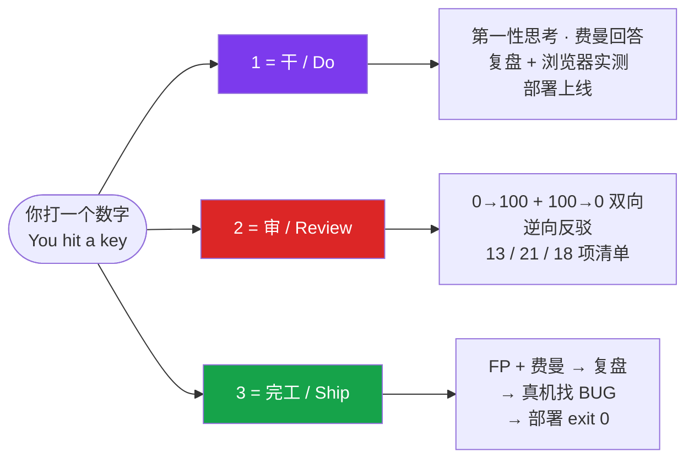

<div align="center">

# ⌨️ 123-flow

### 三个数字键, 接管你和 AI 的整个工作流
### Three number keys to run your entire AI-coding workflow

**`1` 干到底　·　`2` 往死里审　·　`3` 收尾上线**
**`1` ship it　·　`2` tear it apart　·　`3` go live**

[](LICENSE)
[](https://code.claude.com/docs/en/skills)
[](https://agentskills.io)
[](#)
[](https://github.com/LouisLin0723/123-flow/stargazers)

</div>

---

## 🎯 一句话 / TL;DR

> 给 AI 装一个**方向盘**: 打 `1` 让它干、打 `2` 让它审、打 `3` 让它上线。
> 一个字符切换工作流阶段 —— 不用每次组织一长串话, 而且逼 AI 别敷衍。

> Give your AI a **steering wheel**: hit `1` to execute, `2` to review, `3` to ship.
> One keystroke switches workflow phase — no more typing full sentences, and it stops the AI from cutting corners.



## 😤 痛点 / The Problem

你跟 AI 写代码, 是不是每天重复打这几句:

- "嗯可以, 你继续" / "对就这样, 干吧"
- "等等, 帮我检查一遍有没有 BUG / 漏洞"
- "好了没? 上线了吗? 真的能用吗?"

一天几十遍。手累, 而且 AI 常**敷衍** —— 嘴上说"搞定了", 实际没测、没上线、藏着雷。

> *Every day you retype the same three things: "keep going", "wait, check for bugs", "is it actually shipped?". Tiring — and the AI keeps claiming "done" when it isn't.*

## ✅ 解法 / The Fix

三件事各绑一个数字键。打一个字符, AI 进入对应的**完整工作流**:

| 键 | 一句话 | 背后跑的是 |
|:---:|---|---|
| **`1`** | 干到底 | 全速执行 + 第一性思考 + 费曼回答 + 自动复盘 + 浏览器实测 + 部署上线 |
| **`2`** | 往死里审 | 0→100 + 100→0 双向复盘 + 逆向反驳 + 13 / 21 / 18 项分领域清单 |
| **`3`** | 收尾上线 | 第一性+费曼 → 复盘 → 真机实测找 BUG → 部署验证 `exit 0` |

> 核心: 打 `1` 不是敷衍地继续, 是带着一整套铁律继续。打 `2` 是逼 AI 当自己的对手。打 `3` 是真的开浏览器走一遍 + 确认线上能用。

## 🎬 什么时候用 / When to use

对号入座 —— 凡是这些情况, 你只需打一个数字键:

| 你遇到这种情况 | 打 | 会发生什么 |
|---|:---:|---|
| AI 给了方案 / 建议, 你认可, 懒得再打一长串"那就这样开始干" | `1` | 直接执行到底, 自带全套铁律 (第一性思考 → 复盘 → 浏览器实测 → 上线) |
| AI 说"做完了 / 修好了", 你将信将疑 | `2` | 逼它当自己的对手, 双向复盘 + 揪出它没测的边界 |
| AI 凭记忆瞎写, 你担心 API / 用法用错 | `2` | 复盘清单里"查证过"那条, 逼它真去搜证实 |
| 功能开发完准备上线, 怕它没真部署 / 没测手机 | `3` | 强制真机实测 + 部署验证, `exit 0` 才放行 |
| 深夜赶工, 懒得组织语言 | `1` `2` `3` | 三个键搞定"干 → 审 → 上线"整个节奏 |

> 一句话: **凡是你想对 AI 说"继续 / 你确定吗 / 上线了吗", 都能压成一个数字键。**
> *Whenever you'd type "keep going" / "are you sure?" / "is it live?" — compress it into one keystroke.*

## ⭐ 重点: `2` 复盘是灵魂 / The Soul is `2`

会写代码的 AI 满地都是, 但能**回头审自己、戳穿"虚假完成"**的 AI 很少。
AI 默认讨好你 —— 你说改它就改, 你不问它就说"好了"。`2` 强制它反向找茬:

- **双向推演** — 0→100 顺着证明它成立, 再 100→0 倒着拆它哪里最弱
- **逆向反驳** — 主动列"这方案会怎么死"
- **三组清单挑一** — 新功能 13 问 / 代码 21 问 / 算法 18 问, 每条都是一把戳穿敷衍的刀

> *Any AI can write code. Few can turn around and tear their own work apart. `2` forces the AI to be its own adversary — bidirectional review, reverse rebuttal, and a domain-specific checklist of up to 21 sharp questions.*

完整清单 (逐条大白话解释) 见 [`skills/123-flow/SKILL.md`](skills/123-flow/SKILL.md)。

## 📦 安装 / Install

**A. Plugin 一键装 (推荐 / recommended):**

```
/plugin marketplace add LouisLin0723/123-flow
/plugin install 123-flow@123-flow
```

**B. 手动 clone / manual:**

```bash
git clone https://github.com/LouisLin0723/123-flow.git
cp -r 123-flow/skills/123-flow ~/.claude/skills/
```

重启 Claude Code 生效。完整方法论 → [`skills/123-flow/SKILL.md`](skills/123-flow/SKILL.md)。

## 🧠 为什么有效 / Why it works

1. **肌肉记忆 / Muscle memory** — 一个字符 vs 一整句话。越短越会用, 越用越顺手。
2. **对抗 AI 的讨好倾向 / Beats AI sycophancy** — `2` 强制反向找茬, 戳穿"虚假的完成"。这是灵魂。
3. **闭环 / A closed loop** — `1` 往前冲、`2` 回头审、`3` 真上线, 三键拼成一个完整的 AI 协作闭环, 不留尾巴。

## 🔧 自定义 / Customize

这套 1/2/3 是作者的工作流约定。Fork 它, 改 [`SKILL.md`](skills/123-flow/SKILL.md) 里的触发词、检查清单、部署命令, 换成你自己的节奏。

> 它不绑定任何具体项目或框架 —— 是一套**可迁移的工作流骨架**。
> *Project- and framework-agnostic. A portable workflow skeleton, not a config dump.*

## 📄 License

MIT © [Louis Lin](https://github.com/LouisLin0723)

---

<div align="center">

**这套工作流帮你省了脑子? 点个 ⭐ Star 收藏一下 ❤️**
**Saved you some brain cycles? Drop a ⭐ — it helps others find it.**

</div>
